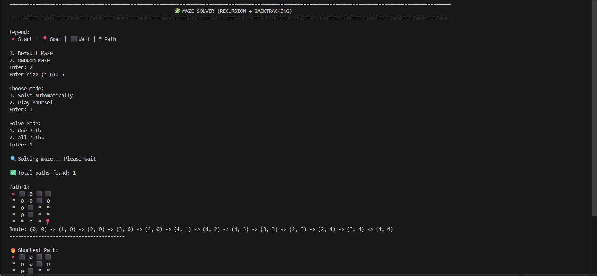
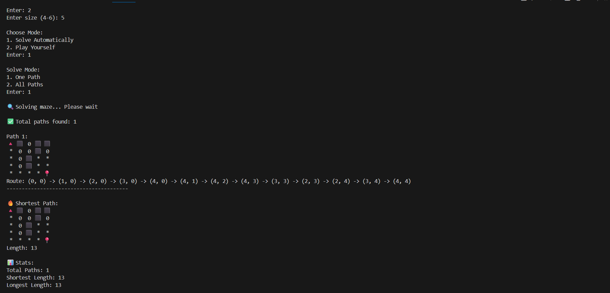

# 🧩 Maze Solver (Recursion + Backtracking)

A command-line Maze Solver built using **Depth First Search (DFS)** and **Recursion with Backtracking**.

This project demonstrates core algorithmic thinking, state tracking, and recursive problem solving.

---

## 🚀 Features

- 🔍 Solve maze automatically (One Path or All Paths)
- 🎮 Interactive Play Mode (manual movement + backtracking)
- 🎲 Random Maze generation (size 4–6)
- 🧠 DFS (Depth First Search) implementation
- 🔁 Proper backtracking logic
- 🛑 Infinite loop prevention using visited matrix
- 📊 Path statistics (shortest & longest path)

---

## 🧠 Concepts Used

- Recursion
- Backtracking
- Depth First Search (DFS)
- State management
- Matrix traversal
- Input validation
- CLI interaction design

---

## 🗺️ Maze Legend

| Symbol | Meaning |
|--------|---------|
| 🔺 | Start |
| 📍 | Goal |
| ⬛ | Wall |
| 0 | Free Path |
| * | Solution Path |

---

## 📦 How It Works

The solver uses a recursive DFS approach:

1. Start from the top-left cell.
2. Explore all valid directions (Up, Down, Right, Left).
3. Mark visited cells to prevent cycles.
4. Backtrack when hitting walls or dead ends.
5. Store valid paths.
6. Display statistics.

For manual mode:
- Move using **W / A / S / D**
- Press **B** to backtrack one step.

---

## ▶️ How to Run

- Make sure you have Python 3 installed.

```bash
python maze_solver.py
```
- Follow the on-screen menu.

---

## 📊 Example Output

- Total paths found
- Visual maze display
- Shortest path
- Longest path
- Interactive movement (Play Mode)

---

## 🎯 Why This Project?

This project was built to strengthen understanding of:

- Recursive thinking
- Backtracking patterns
- Algorithm flow control
- State restoration
- Clean CLI structure

It represents a milestone in mastering foundational DSA concepts.

---

## 👨‍💻 Author

**Mohamed Nibras**  
B.Tech CSE (AI) Student  
Focused on building strong foundations in Algorithms & Problem Solving  

---

## 📸 Preview




---

## 📌 Future Improvements

- Add BFS (Shortest Path guaranteed)
- Add visualization using GUI (Tkinter / Pygame)
- Add maze solvability check before play
- Export path results to file